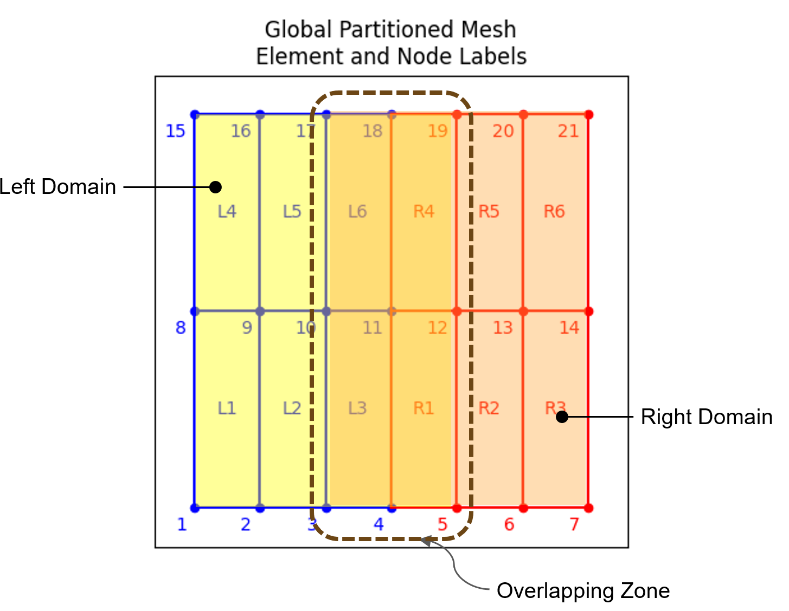

# Parallel_Compute

An educational example demonstrating domain decomposition and parallel computing using Python.

## Description

This project visualizes a 2D domain split into quadrilateral elements — a basic concept used in finite element methods and parallel computing environments like MPI.

It is intended for illustrating how computational domains can be divided and labeled for multi-process workloads. Two different methods - direct Schur method and alternating Schwarz method has been implemented in the code. 

## Finite Element Domain

An example mesh showing quadrilateral elements and node numbering:

## Technologies Used

- Python
- Parallel Domain Decomposition
- Finite Element concepts
- OpenSees

## Direct Schur Method

 A finite element domain, which is composed by 4 quadrilateral elements. Cut the domain into different parts (left and right subdomain), formulate the stiffness matrix according in different CPU cores. In each subdomain, there are internal DOFs and interface DOFs. Compute the Schur complements (condense all internal Dofs), assemble the interface matrix, and solve the interface displacements. With the interface displacements, go back each subdomain and solve the internal displacements. Also see Fig.~\ref{fig:finite_element_domain}. For each subdomain, the finite element system can be written as:
    
    \begin{equation}
        \begin{bmatrix}
        K_{II} & K_{IG} \\
        K_{GI} & K_{GG}
        \end{bmatrix}
        \begin{bmatrix}
        u_I \\
        u_\Gamma
        \end{bmatrix}
        =
        \begin{bmatrix}
        R_I \\
        R_\Gamma
        \end{bmatrix}
    \end{equation}
    
    By eliminating the interior degrees of freedom \( u_I \), we obtain the local Schur complement system:
    
    \begin{equation}
        S^{(i)} u_\Gamma = g^{(i)}
    \end{equation}
    
    where
    
    \begin{equation}
        S^{(i)} = K_{GG}^{(i)} - K_{GI}^{(i)} (K_{II}^{(i)})^{-1} K_{IG}^{(i)}, \quad
    \end{equation}
    
    \begin{equation}
        g^{(i)} = R_\Gamma^{(i)} - K_{GI}^{(i)} (K_{II}^{(i)})^{-1} R_I^{(i)}
    \end{equation}
    
    The global interface system is then assembled as:
    
    \begin{equation}
        \left( \sum_i S^{(i)} \right) u_\Gamma = \sum_i g^{(i)}
    \end{equation}
    Once the interface displacement \( u_\Gamma \) is obtained by solving the global system, it is substituted back into the original system to compute the internal displacements \( u_I \) for each subdomain. This is done by solving:

    \begin{equation}
        u_I = (K_{II})^{-1} (R_I - K_{IG} u_\Gamma)
    \end{equation}
    

## Alternating Schwarz Method

