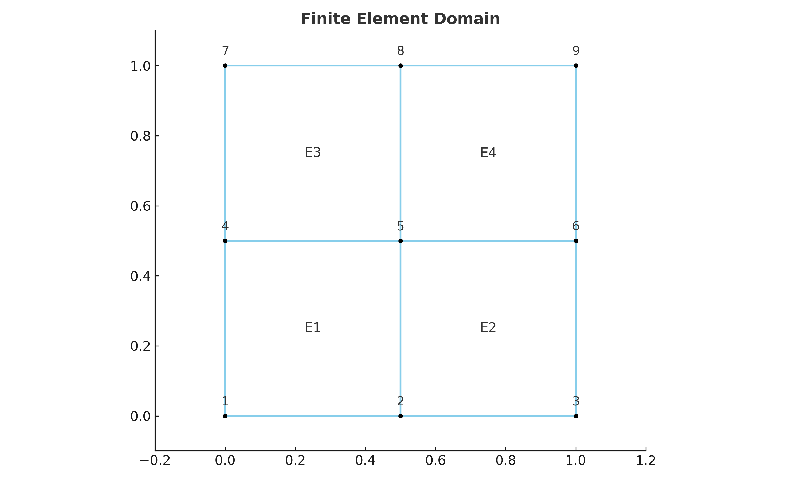

# Parallel_Compute

An educational example demonstrating domain decomposition and parallel computing using Python.

## Description

This project visualizes a 2D domain split into quadrilateral elements — a basic concept used in finite element methods and parallel computing environments like MPI.

It is intended for illustrating how computational domains can be divided and labeled for multi-process workloads.

## Finite Element Domain

An example mesh showing quadrilateral elements and node numbering:

## Technologies Used

- Python
- Parallel Domain Decomposition
- Finite Element concepts with [xara](https://xara.so)

## File Structure

- `main.py` – Main execution file
- `ddm.py`, etc. – Domain decomposition logic
-  `model.py` - Opensees model to validate the results of parallel computing.

