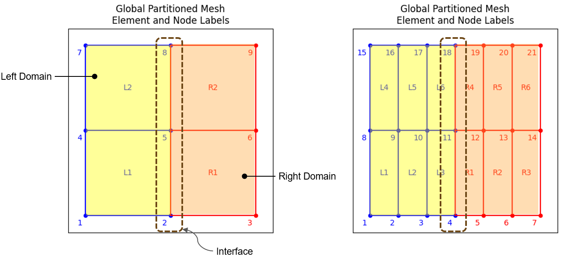

# Parallel_Compute

An educational example demonstrating domain decomposition and parallel computing using Python.

## Description

This project visualizes a 2D domain split into quadrilateral elements — a basic concept used in finite element methods and parallel computing environments like MPI.

It is intended for illustrating how computational domains can be divided and labeled for multi-process workloads. Two different methods - direct Schur method and alternating Schwarz method has been implemented in the code. 

## Finite Element Domain

An example mesh showing quadrilateral elements and node numbering:

## Direct Schur Method

The first method we have implemented is the so-called **Direct Schur Method**, and its process is summarized as follows:

1. Compute the **Schur complements** by condensing the internal DOFs.
2. Assemble the **global interface matrix** and solve for the interface displacements.
3. Use the interface displacements to recover the internal displacements within each subdomain.
    

## Alternating Schwarz Method

We have also implemented **Alternating Schwarz Method**:

1. The Schwarz method decomposes the domain into overlapping subdomains.  
2. Each subdomain solves its local problem iteratively using boundary info from neighbors.  
3. Solutions are combined and updated until the global solution converges.

